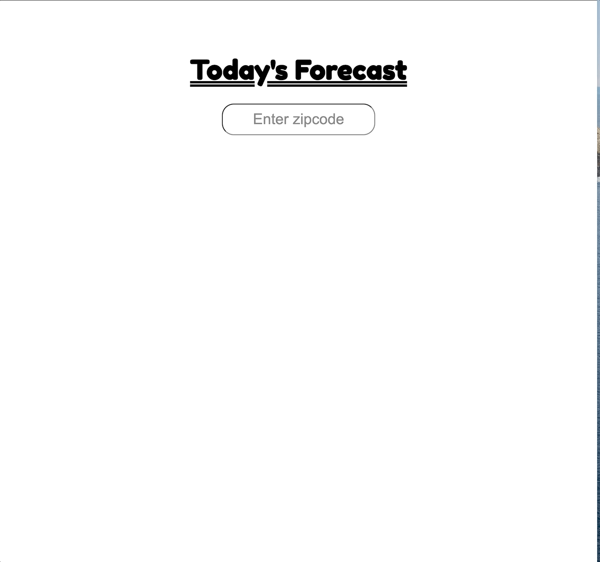

# Weather

A simple weather app using React. A working demo can be found [here](https://devashrlucas.github.io/weatherapp/).

## Getting Started

Please note: this project only works with US 5-digit zip codes.

**This project requires the use of a third-party API and an API key. The API key should be stored as an environmental variable. The API key is set under the `API_KEY` variable in the `App.js` file.**

### Prerequisites

* Internet connection.
* OpenWeather.org API key. Please sign up for your own API key [here](https://openweathermap.org/api).

### Installing

```
git clone https://github.com/devashrlucas/weatherapp.git
cd weather
npm i
```
#### Test
```
npm test
```

#### Development build
```
npm start
```

#### Production build
```
npm run-script build
```


This project was bootstrapped with [Create React App](https://github.com/facebook/create-react-app). Please refer to the Create React App [README.md](https://github.com/facebook/create-react-app/blob/master/packages/cra-template-typescript/template/README.md) for the available scripts.


## Demo

Here is a short demo featuring error handling functionalities as well as a successful search.



## Running the tests
```
cd weather
npm test
```

### Unit testing

There is a test to make sure that error handling is working properly. Error handling in this app is mainly handled by form validation. The test is designed to make sure that the user will see an alert if their entry contains non-numeric characters and/or is not 5 digits long.


## Built With

* HTML/CSS - markup and styling
* JavaScript - event handling
* React - user interface
* Jest - test runner
* @testing-library/react - React component tests

## Authors

* **Ashley Lucas** - *Initial Author* - [website](https://devashrlucas.github.io/)

See also the list of [contributors](https://github.com/devashrlucas/weatherapp/graphs/contributors) who participated in this project.

## License

This project is licensed under the MIT License - see the [LICENSE.md](LICENSE.md) file for details

## Acknowledgments

* Weather data: [Weather API](https://openweathermap.org/api) by OpenWeather
* Weather icons: [Weather 7 Icon Font Set](https://www.pixeden.com/icon-fonts/weather-7-icon-font-set) by Pixeden
